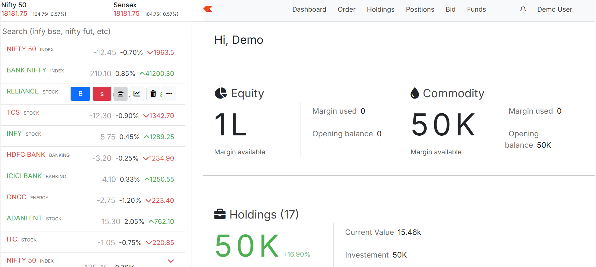
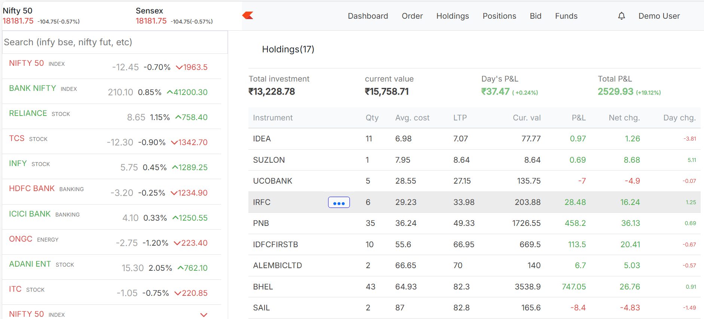

# Zerodha Clone 🪙 – Dasboard (Kite)

A frontend clone of the popular stock trading platform **Zerodha (Kite)** built using **ReactJS**. This project is developed for learning purposes and demonstrates a strong grasp of UI/UX replication, component architecture, and responsive design in a modern web application.

---

## 🚀 Features

- ⚛️ Built using ReactJS functional components and Hooks
- 🧭 Navigation with React Router
- 📊 Dashboard layout with:
  - Holdings Table
  - Positions Table
  - Orders View
  - Funds Section
- 📱 Fully responsive and mobile-friendly
- 🎨 Styled with custom CSS to closely replicate Zerodha's UI
- 🔁 Component reusability and clean folder structure

---

## 📁 Project Structure
zerodha-clone/
├── public/
│ └── index.html
│ └── Assets / #All the image used
├── src/
│ ├── components/ # Reusable UI components (Navbar, Tables, etc.)
│ ├── pages/ # Page-level components (Dashboard, Holdings, etc.)
│ ├── App.js # Root component
│ ├── index.js # App entry point
│ └── App.css # Global styles
├── .gitignore
├── package.json
└── README.md


---

## 🧑‍💻 Technologies Used

- **ReactJS** (v18+)
- **React Router DOM**
- **CSS3** (Flexbox/Grid)
- **JavaScript (ES6+)**

---

## 📸 Screenshots

> Replace these with your own if available

- ![Dashboard Screenshot]
- ![Holdings Table]
- ![Order table]
---

## 🛠️ Getting Started

### 1. Clone the Repository

```bash
git clone https://github.com/divyanshu-kumar123/dashboard.git
cd dashboard
npm start

